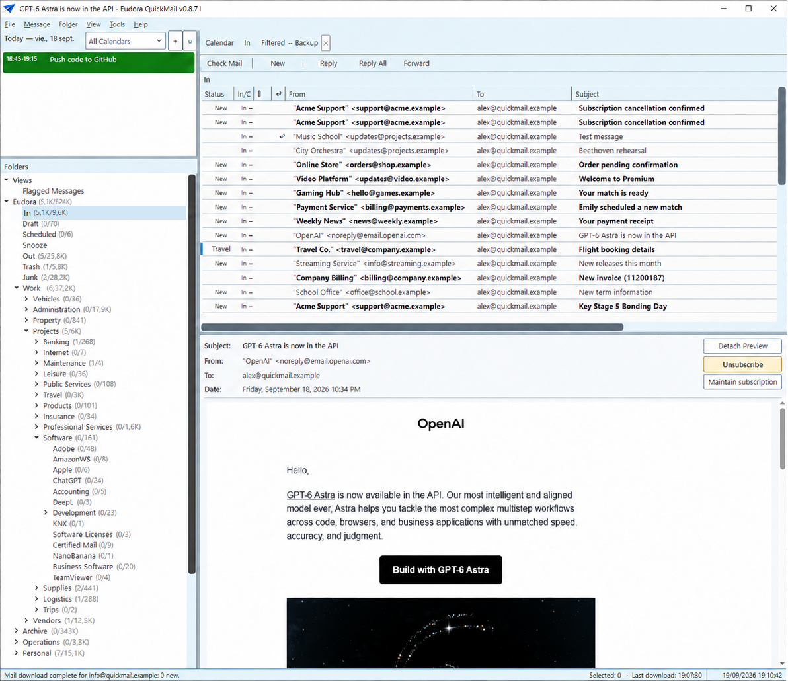

# Eudora QuickMail


<p align="center">
  
</p>

**A free, open-source, local-first desktop email client for Windows.** Eudora QuickMail
brings multiple accounts, large mail archives, calendars and contacts into one fast,
keyboard-driven workspace.

[Product website](https://www.dinamica.tech/eudoraquickmail) ·
[Download for Windows](https://github.com/DinamicaTech/QuickMail/releases/download/v0.8.72/EudoraQM-Setup.exe) ·
[All release files](https://github.com/DinamicaTech/QuickMail/releases/latest) ·
[User guide](USERGUIDE.md) ·
[Report a problem](https://github.com/DinamicaTech/QuickMail/issues)

> **Project status:** active development. QuickMail is already used with real mail archives,
> but it has not yet reached a stable 1.0 release. Back up important data and review the
> release notes before upgrading.

## Email that stays out of your way

QuickMail is designed for people who live in email and want their client to help them work,
not compete for their attention. It combines the speed and filing-oriented workflow that made
classic Eudora distinctive with current Windows integration and modern mail services.



| | Capability |
|---|---|
| **Mail, brought together** | Multiple IMAP, SMTP, POP3 and Microsoft Graph accounts; unified views; conversation threading; shared mailboxes; safe move, copy, archive, delete and restore workflows. |
| **Fast local search** | SQLite-backed local storage, near-instant search across large archives, saved views and full-text search inside supported attachments. |
| **Calendar in context** | Local calendars and Google Calendar integration; day, week and month views; event editing; ICS invitation detection and RSVP controls. |
| **People and organization** | Local address book and groups, optional Google and Microsoft contact sync, iCloud support, rules with real-message preview and recipient discovery. |
| **Productivity tools** | Templates, scheduled sending, snooze, watched conversations, forgotten-attachment warnings, message export and an offline outgoing queue. |
| **Accessible by design** | Full keyboard navigation, customizable shortcuts, command palette, screen-reader labels, focus feedback, themed high-contrast-friendly controls and reader mode. |

## Local-first and privacy-conscious

QuickMail connects directly from your computer to the providers and servers you configure.
It does not require a Dinámica Ingeniería cloud account.

- Working mail data, calendars, contacts and search indexes stay in the local QuickMail profile.
- Passwords are stored in Windows Credential Manager.
- OAuth tokens are protected with Windows security.
- Message HTML is rendered with scripts disabled and a restrictive content security policy.
- Online integrations are optional and used only for the capabilities you enable.

See the [privacy policy](https://www.dinamica.tech/privacy) for the complete description of
data handling.

## Bring your Eudora history forward

The included Eudora importer provides a dedicated migration path for classic mailboxes,
folders, messages and attachments. Large archives are processed with visible progress,
recovery safeguards and a local data model designed to preserve message identity.

The name reflects both sides of the project: **Eudora** honours the application and workflow
that inspired it, while **QuickMail** credits the open-source project on which this fork was
built and describes its goal—making serious email work remarkably fast.

## Download and install

Release installers are published on the
[GitHub Releases page](https://github.com/DinamicaTech/QuickMail/releases). For most PCs, use the
[direct Windows installer](https://github.com/DinamicaTech/QuickMail/releases/download/v0.8.72/EudoraQM-Setup.exe).
Choose the Windows
x64 package for most PCs or the ARM64 package for native Windows on ARM. Portable executables
are also provided.

> The first DinamicaTech build is published as a **pre-release** and is temporarily unsigned
> while the project onboards to SignPath Foundation. Windows may therefore show an
> "Unknown publisher" warning. It will not be promoted to a stable release until project-owned
> signing is in place.

## Requirements

- Windows 10/11 x64
- Windows 11 ARM64 for the native ARM64 build
- [.NET 8 SDK](https://dotnet.microsoft.com/download) (to build from source)
- [WebView2 Runtime](https://developer.microsoft.com/microsoft-edge/webview2/) (usually pre-installed on Windows 11)

## Build & Run

```bat
build.bat            # build
build.bat run        # build + launch
build.bat publish    # self-contained win-x64 exe → publish/
build.bat installer  # publish + build the Windows installer → installer/Output/
build.bat clean
```

Building the installer additionally requires [Inno Setup 6](https://jrsoftware.org/isdl.php).
It produces `installer/Output/eudora-quickmail-v<version>-setup.exe`. See [`installer/README.md`](installer/README.md)
for details.

Or with the CLI:

```bash
dotnet run --project QuickMail
```

## Keyboard shortcuts

| Key | Action |
|-----|--------|
| Ctrl+0 | Focus toolbar |
| Ctrl+1 | Focus account list |
| Ctrl+2 / Ctrl+Y | Focus folder tree |
| Ctrl+3 | Focus message list / conversation tree |
| Ctrl+9 | Focus status bar |
| F6 / Shift+F6 | Cycle through panes |
| Ctrl+N | New message |
| Ctrl+R | Reply |
| Ctrl+Shift+R | Reply all |
| Ctrl+F | Forward |
| Ctrl+Shift+F | Search folders |
| Ctrl+Shift+B | Open Address Book |
| Delete | Delete selected message(s) / conversation |
| Escape | Close reading pane |

### Address Book (Ctrl+Shift+B)

| Key | Action |
|-----|--------|
| F2 | Edit selected contact |
| Delete | Delete selected contact |
| Ctrl+Shift+P | Command palette (Add, Edit, Save, Cancel, etc.) |

For the full list, including shortcut customization, see
[`docs/KEYBOARD-SHORTCUTS.md`](docs/KEYBOARD-SHORTCUTS.md) or the **Keyboard shortcuts** tab
in Settings.

## Project layout

```
QuickMail/
├── App.xaml.cs              # DI composition root
├── Views/
│   ├── MainWindow.xaml(.cs) # 3-pane layout; keyboard nav; WebView2
│   ├── ComposeWindow.xaml   # New / Reply / Forward
│   ├── AccountManagerDialog.xaml
│   └── FolderPickerWindow.xaml  # Destination picker for move/copy/go-to-folder commands
├── ViewModels/
│   ├── MainViewModel.cs     # Master state
│   ├── ComposeViewModel.cs
│   └── AccountManagerViewModel.cs
├── Services/
│   ├── ImapService.cs       # IMAP via MailKit; client pool per account
│   ├── SmtpService.cs       # Send via MailKit
│   ├── SyncService.cs       # Background sync
│   ├── ConversationBuilder.cs
│   ├── AccountService.cs    # Persist accounts to %APPDATA%\QuickMail\
│   ├── CredentialService.cs # Windows Credential Manager
│   ├── ConfigService.cs     # config.ini + hotkey settings
│   ├── LocalStoreService.cs # SQLite cache
│   └── LogService.cs
└── Models/
    ├── AccountModel.cs
    ├── MailMessageSummary.cs / MailMessageDetail.cs
    ├── ConversationGroup.cs
    ├── MailFolderModel.cs
    └── ComposeModel.cs
```

## Documentation

- [`USERGUIDE.md`](USERGUIDE.md) — complete user guide
- [`FORK_CHANGELOG.md`](FORK_CHANGELOG.md) — history of this fork
- [`CHANGELOG.md`](CHANGELOG.md) — project changelog
- [`docs/ARCHITECTURE.md`](docs/ARCHITECTURE.md) — architecture overview
- [`AI_HANDOFF.md`](AI_HANDOFF.md) — detailed product specification, behavioral invariants and reconstruction notes
- [`CONTRIBUTING.md`](CONTRIBUTING.md) — how to contribute

## CI and releases

Every push to `main` and every pull request builds and uploads `EudoraQM.exe` as an artifact via GitHub Actions.

To publish a release, push a version tag:

```bash
git tag v1.0.0
git push origin v1.0.0
```

This triggers a pre-release with installers, update-feed assets and portable executables.
Signing is intentionally disabled until the repository is approved and configured for
[SignPath Foundation](docs/SIGNING.md); no credentials from the upstream project are reused.
See [`installer/README.md`](installer/README.md) for local installer builds.

## Dependencies

| Package | Purpose |
|---------|---------|
| [MailKit](https://github.com/jstedfast/MailKit) | IMAP + SMTP |
| [CommunityToolkit.Mvvm](https://github.com/CommunityToolkit/dotnet) | ObservableProperty, RelayCommand |
| [Microsoft.Data.Sqlite](https://learn.microsoft.com/dotnet/standard/data/sqlite/) | Local mail cache |
| [Microsoft.Web.WebView2](https://developer.microsoft.com/microsoft-edge/webview2/) | HTML email rendering |
| [AdysTech.CredentialManager](https://github.com/AdysTech/CredentialManager) | Windows Credential Manager |

## IMAP concurrency

QuickMail opens a small per-account IMAP connection pool. This prevents MailKit's "ImapClient is currently busy" error when background sync is running and you open a message, preview text, download attachments, or move/copy mail. The default is 6 simultaneous IMAP connections per account and can be changed in `%AppData%\QuickMail\config.ini` with `MaxImapConnectionsPerAccount`.

Foreground actions such as opening messages and downloading attachments get reserved connection capacity. Background sync, polling, UID checks, and preview fetching are deliberately capped below the full pool so they do not occupy every available connection.

## Origin and license

Eudora QuickMail is a fork of [QuickMail](https://github.com/kellylford/QuickMail), created
by Kelly Ford and developed further by the Eudora QuickMail contributors. The project is
released under the [MIT License](LICENSE).
